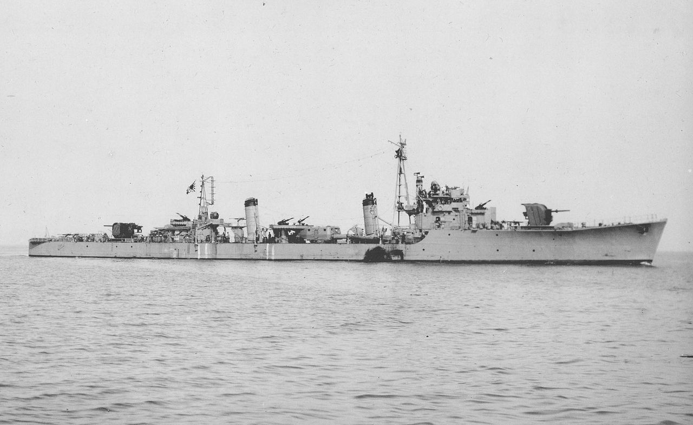

  

 
<h3 align=center>IJN Destroyer Momi The most numerous IHN destroyer class.</h2>
<h4 align=center style="font-size:0.8rem">This picture is from <a href="hhttps://en.wikipedia.org/wiki/Matsu-class_destroyer#/media/File:Momi_II.jpg">Wikipedia</a>, which has a pretty good summary of these warships.</h3>
 

# Destroyers as Cargo Ships

Jon Parshall, during an interview with Drach, commented that an analysis had been performed of the inefficiency of IJN cargo operations during the Guadalcanal campaign. The IJN lost the ability to use cargo ships during the Guadalcanal campaign and were forced to use destroyers to deliver supplies to the island garrisons. These operations were inefficient because destroyers could deliver minimal supplies at high fuel cost.

# IJN Classed by Number

| Class                      | Number |
| -------------------------- | ------ |
| Tachibana (Matsu Flight B) | 23     |
| Momi                       | 21     |
| Fubuki                     | 20     |
| Yugumo                     | 20     |
| Kagero                     | 18     |
| Matsu                      | 18     |
| Minekaze                   | 15     |
| Akizuki                    | 13     |
| Shiratsuyu                 | 10     |
