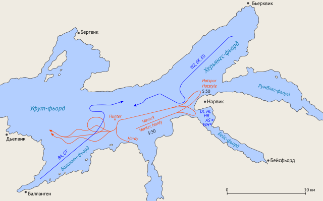

  

 
<h3 align=center>Map of the First Battle of Narvik</h2>
<h4 align=center>This map, from <a href="https://www.warhistoryonline.com/war-articles/battles-of-narvik-norways-toughest-fight.html?chrome=1">here</a>, shows the basics of the First Battle of Narvik.</h3>
 

# Narvik Ship Losses

Narvik was the key shipping point for Swedish iron ore to Germany during WW2. Narvik was both the end point of a rail line and and ice-free port. 

## Abstract

### Background

## Analysis
