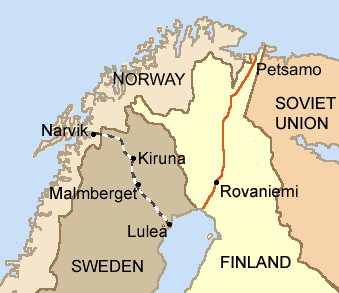

  

 
<h3 align=center>Lancaster Bomber Being Prepped for Sowing Mines Mines Like These Sunk Many Ships, Including Ships carrying Swedish Ore</h2>
<h4 align=center style="font-size:0.8rem">This picture is from <a href="https://www.lancaster-ed559.co.uk/raf-gardening-operations-during-the-second-world-war.html">ED559</a> website, which is focused on the Lancaster bomber.</h3>
 

# Swedish Iron Ore Shipments to Germany During WW2

I was watching an excellent presentation on the UK minelaying operations during WW2 and a statement was made about Swedish shipments of iron ore to Germany during the war. This piqued my interest and I wanted see what data I could pull up on the subject.

## Abstract

## Background

### Nomenclature

<dl>
<dt style="font-style:italic">contact activated</dt>
<dd>A mine that is activated by contact with the ship. There were some air dropped contact mines, but their use was limited.</dd>
<dt style="font-style:italic">magnetic activated</dt>
<dd>A mine that is activated by the magnetic field around a ship. This type of mine can be defeated by <a href="https://en.wikipedia.org/wiki/Degaussing">degaussing</a> or by sweeping using sleds that mimic the magnetic field of a ship.</dd>
<dt style="font-style:italic">pressure activated</dt>
<dd>A mine that is activated by the pressure wave generated by a ship passing over it</dd>
</dl>

### Why Narvik?

There are only two ports to ship iron-ore out of: Narvik and Lulea. Only Narvik was open year-round. The following figure nicely illustrates the geographic issue.

  

### Mine Laying Reference

I became interested in this subject while listening to a WW2TV broadcast on Minelaying [here]([https://www.youtube.com/live/8g2pL25W3x0?feature=share). The presentation was by [Jane Gulliford Lowes](https://www.justcuriousjane.com/store-buy-books/ABOVE-US-THE-STARS-p191664106). I did not know that the UK laid mines to hinder iron ore shipments to Germany.

### Data References

Here is where I got my data:

- [Sweden's iron ore exports to Germany, 1933–1944](./References/Sweden%20s%20iron%20ore%20exports%20to%20Germany%201933%201944.pdf)

- [Norwegian ship losses](https://www.warsailors.com/freefleet/shipstats.html)
- [Swedish Iron Ore Industry in WW2](https://en.wikipedia.org/wiki/Swedish_iron-ore_industry_during_World_War_II)

### Operations Against Ore Carriers

There were specific operations to stop iron ore shipments through mining. Note that the shipments were mainly from the Norwegian port of Narvik. The operations included:

- [Operation Wilfred](https://en.wikipedia.org/wiki/Operation_Wilfred)

## Analysis
