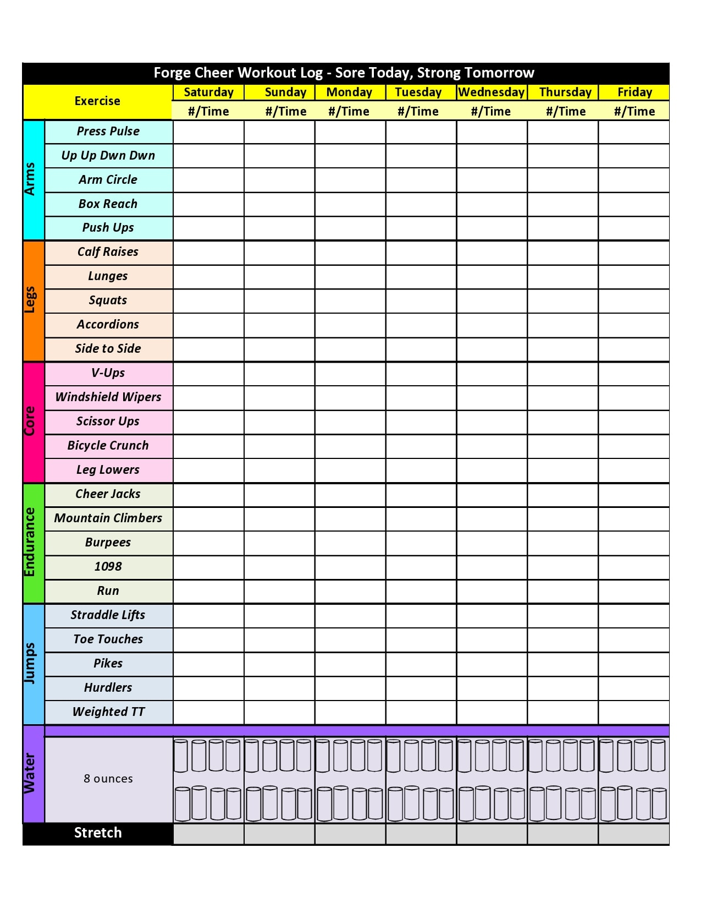
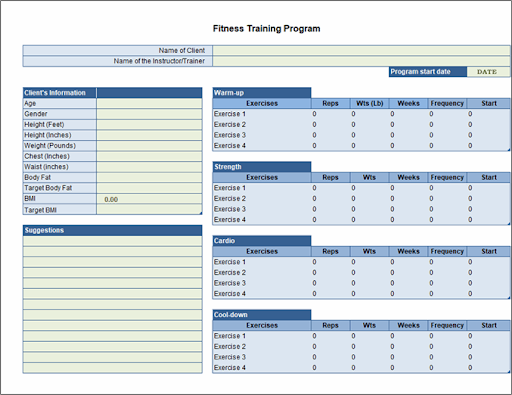

## Training Worksheet Requirements

- One sheet per week
- Ability to gather aggregate data

## Training Worksheet Examples

### Example 1

I like several things I like about this worksheet:

- One sheet per week
- Nice breakdown by muscle group

What I don't like:

- No need for Endurance and Jump categories
- No need for water
- I would like to log sets, reps, weight separately.

### Example 2

I like several things I like about this worksheet:

- Personal metadata
- Freeform field
- Reps, sets, and weight

What I don't like:

- Only one day

